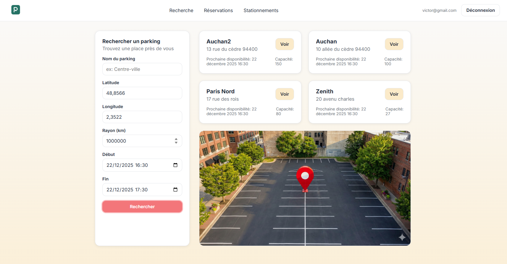

# Parking

Environnement Docker avec PHP 8.3, Composer 2, PHPUnit 12, MySQL (app + tests) et PhpMyAdmin.

## Apercu de l'interface


## Prerequis
- Docker Desktop (ou equivalent) avec Docker Compose plugin.

## Lancer l'infrastructure
1. Construire/zapper les images : `docker compose build`
2. Demarrer les services (PHP, MySQL app/test, PhpMyAdmin, Frontend) : `docker compose up -d`
3. PhpMyAdmin est disponible sur http://localhost:8080 (hote `app_db`, user `parking`, mot de passe `secret`).
4. Frontend (React) disponible sur http://localhost:5173 (configurable via `FRONTEND_PORT`).
5. Deux bases MySQL sont initialisees automatiquement :
   - `parking` (application) depuis `infrastructure/mysql/app/init.sql`
   - `parking_test` (tests) depuis `infrastructure/mysql/test/init.sql`
6. Le stockage alternatif JSON (pour demontrer l'interchangeabilite des depots) ecrit dans `storage/*.json` (users, parkings, reservations, abonnements, subscription_offers, stationnements, paiements).

## Base de donnees de test
- Dump complet (donnees de test) : `infrastructure/parking.sql`.
- Exemple d'import dans le conteneur MySQL :
  `docker compose exec -T app_db mysql -u parking -psecret parking < infrastructure/parking.sql`

## Modes de persistance (SQL / JSON)

- Choix du driver via `PERSISTENCE_DRIVER=sql|json` (par defaut `json` pour la demo hors base).
- Chemins de stockage JSON configurables : `JSON_USER_STORAGE`, `JSON_PARKING_STORAGE`, `JSON_RESERVATION_STORAGE`, `JSON_ABONNEMENT_STORAGE`, `JSON_SUBSCRIPTION_OFFER_STORAGE`, `JSON_STATIONNEMENT_STORAGE`, `JSON_PAYMENT_STORAGE` (par defaut sous `storage/*.json`).
- Script de reset des fichiers JSON : `php bin/reset-json-storage.php`.
- Mode JSON : disponibilite calculee avec reservations/abonnements/stationnements et revenu mensuel calcule via paiements.
- Tests d'integration :
  - JSON : `./vendor/bin/phpunit --testsuite Integration --filter JsonPersistenceTest`
  - SQL (optionnel) : `RUN_SQL_INTEGRATION=1 PERSISTENCE_DRIVER=sql ./vendor/bin/phpunit --testsuite Integration --filter SqlPersistenceTest` (necessite la base en route).

## Commandes utiles
- Installer les dependances : `docker compose run --rm app composer install`
- Mettre a jour l'autoload : `docker compose run --rm app composer dump-autoload`
- Lancer tous les tests : `docker compose run --rm -e XDEBUG_MODE=coverage app ./vendor/bin/phpunit`
- Lancer une suite : `docker compose run --rm -e XDEBUG_MODE=coverage app ./vendor/bin/phpunit --testsuite Unit` (ou `Integration`, `Functional`)
- Couverture (domaine uniquement) : `docker compose run --rm -e XDEBUG_MODE=coverage app ./vendor/bin/phpunit --coverage-filter src/Domain --coverage-text`
- Couverture HTML : `docker compose run --rm -e XDEBUG_MODE=coverage app ./vendor/bin/phpunit --coverage-html coverage` puis ouvrir `coverage/index.html`
- Ouvrir un shell dans le conteneur : `docker compose run --rm app bash`
- (Optionnel) serveur PHP interne : `docker compose run --rm --service-ports app php -S 0.0.0.0:8000 -t public`
- (Optionnel) reconstruire le frontend avec une URL API differente :
  `FRONTEND_API_BASE_URL=http://localhost:8000 docker compose build frontend`

## Migrations utiles (si base deja creee)
- Normaliser les creneaux d'offres + completer `opening_hours.end_day_of_week` : `php bin/migrate-subscription-days.php`.
- Si la base existait avant, verifier que `reservations.status` inclut `pending_payment`.

## Format des creneaux d'abonnement (multi-jours)
- `weekly_time_slots` (offres) accepte des objets `{start_day,end_day,start_time,end_time}` (dimanche=0 ... samedi=6).
- Exemple week-end : vendredi 18:00 -> lundi 10:00
  ```json
  [{"start_day":5,"end_day":1,"start_time":"18:00","end_time":"10:00"}]
  ```

## Format des horaires d'ouverture (multi-jours)
- `opening_hours` accepte des objets `{start_day,end_day,start_time,end_time}`.
- Si `end_day == start_day` et `end_time < start_time`, la plage traverse minuit.

## API (rappel rapide)
- `GET /api/parkings/subscription-offers` : liste des offres d'abonnement d'un parking.
- `POST /api/parkings/subscription-offers` : creation d'une offre d'abonnement.
- `GET /api/parkings/subscription-plans` : alias vers `/api/parkings/subscription-offers`.
- `GET /api/users/me` : profil utilisateur (JWT).
- `POST /api/users/change-password` : changement mot de passe (JWT).


## IDENTIFIANT CLIENT DE TEST 
Prénom : correction
Nom : vérification
Email : correction@gmail.com
Mot de passe : 12345678

Pour voir plus de parking ajuster le rayon à 10000
